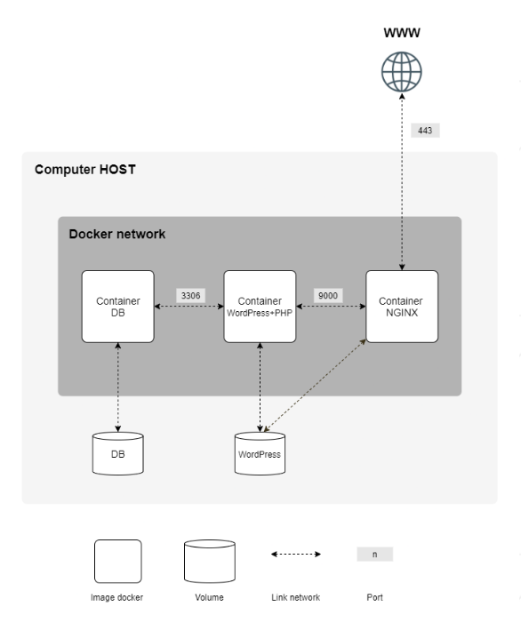
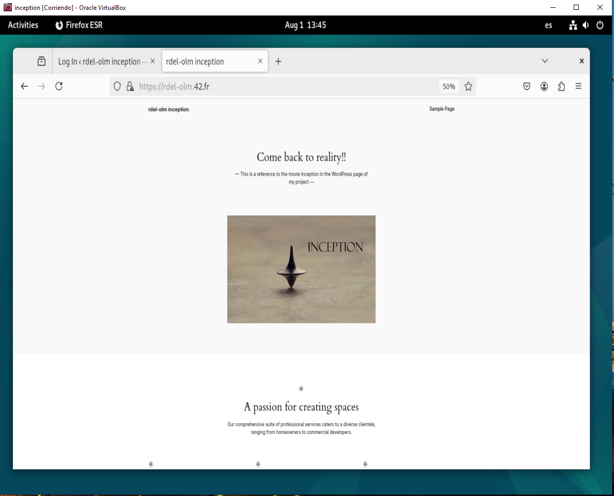

- Project **Inception** of 42:  Deployment of a complete stack of services in Docker containers.
- Includes: **nginx**, **Mariadb**, **WordPress**.  
- Orchestrated with **Docker Compose** and configured for minimal production (volumes, networks, SSL certificates).
- The goal is to set up a small infrastructure with multiple services using Docker containers, following specific rules and best practices.

---


### Infrastructure Components

    * NGINX container with TLSv1.2 or TLSv1.3 only
    * WordPress + PHP-FPM container (without NGINX)
    * MariaDB container (without NGINX)
    * Two volumes: - One for WordPress database - One for WordPress website files
    * A Docker network to connect all containers

### Technical Specifications

   - Must be completed on a Virtual Machine
   - All configuration files must be placed in a srcs folder
   - Must include a Makefile at the root to build the entire application
   - Containers must be built from either Alpine or Debian (penultimate stable version)
   - Each service must have its own Dockerfile
   - Forbidden to use pre-made images (except Alpine/Debian base images)
   - Containers must restart automatically on crash

## Security Requirements

    - No passwords in Dockerfiles

    - Must use environment variables

    - Recommended to use .env file and Docker secrets

    - WordPress admin username must not contain variations of "admin"

    - NGINX must be the sole entry point (port 443 only)

    - Domain name must be login.42.fr (replace "login" with your actual login)


```text
16.Inception-main/
├── imgReadme/
├── imgs/
├── project/
│   ├── srcs/
|   | ├── requirements
│   |    ├── mariadb/
│   |    │   ├── conf         # Configuración de BBDD
│   |    │   ├── tools           
│   |    │   └── Dockerfile
│   |    ├── nginx/
│   |    │   ├── conf         # Configuración de servidor
│   |    │   └── Dockerfile
│   |    ├── wordpress/
│   |    │   ├── conf         # Configuración WordPress
│   |    │   ├── tools           
│   |    │   └── Dockerfile
│   |    └── tools/           # Scripts y utilidades (certificados, setup)
|   ├── .env
|   └── docker-compose.yml
├── eval_test.txt
├── make_directories.sh
└── README.md                 # Este documento
```


### Remove all Docker containers, images, volumes, and networks. 

  -  `docker stop $(docker ps -qa);`
  -  `docker rm $(docker ps -qa);`
  -  `docker rmi -f $(docker images -qa);`
  -  `docker volume rm $(docker volume ls -q);`
  -  `docker network rm $(docker network ls -q) 2>/dev/null`

### NGINX service must be the sole entry point into your infrastructure

  -  `docker ps --format 'table {{.Names}}\t{{.Ports}}'`

### Ensure that WordPress website is properly installed

  -  `docker exec -it wordpress wp core is-installed --allow-root && echo "WP is installed" || echo "WP is NOT installed"`
  -  `docker-compose down --volumes`
  -  `docker exec -it wordpress wp core is-installed --allow-root && echo "WP is installed" || echo "WP is NOT installed"`
  -  `docker-compose up -d --build`
  -  `docker exec -it wordpress wp core is-installed --allow-root && echo "WP is installed" || echo "WP is NOT installed"`
  -  `docker exec -it wordpress wp user list --allow-root`

### PERSISTENCE

  -  `docker exec -it wordpress wp user list --allow-root`
  -  `docker exec -it wordpress wp comment list --allow-root`
  -  `docker exec -it mariadb mysql -u root -p`


<p align="center">        
  
</p>
<p align="center">        
  
</p>


- Roberto del Olmo Lima
- [](https://github.com/legrol)
 &nbsp;&nbsp;&nbsp;&nbsp;&nbsp;&nbsp;&nbsp;&nbsp;[](https://www.linkedin.com/in/roberto-del-olmo-731746245)

